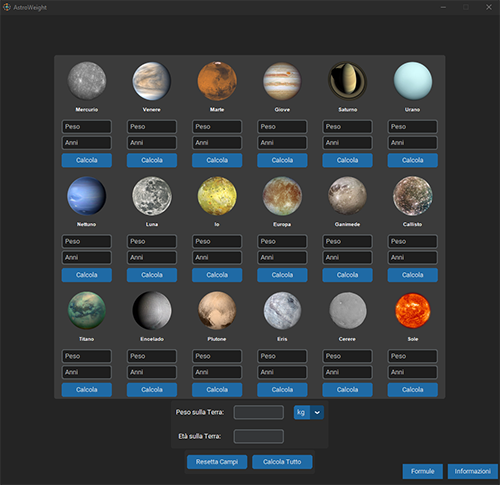

# 🌍 AstroWeight - Calcola il tuo peso e la tua età sugli altri pianeti! 🚀

AstroWeight è un'applicazione desktop sviluppata in Python con Tkinter e CustomTkinter che permette di calcolare il peso e l'età su diversi corpi celesti del nostro sistema solare. Basta inserire il proprio peso e la propria età per scoprire come cambiano su pianeti e lune con diverse gravità e periodi orbitali.



## Descrizione
**AstroWeight** è un'applicazione interattiva basata su Python e Tkinter che permette di calcolare il proprio peso e la propria età su diversi corpi celesti del sistema solare. Include informazioni dettagliate su ciascun pianeta e satellite, con immagini e link per esplorare il sistema solare in 3D.

## Funzionalità
- Calcolo del peso e dell'età su pianeti e satelliti.
- Interfaccia grafica intuitiva con CustomTkinter.
- Finestre separate per informazioni sui pianeti.
- Possibilità di visualizzare le formule di calcolo.
- Collegamenti a risorse NASA per esplorazioni in 3D.

## Struttura del Progetto
```
AstroWeight/
│── images/                    # Contiene le immagini dei pianeti e lo screenshot
│── pianeti/                    # Contiene i file Python per ogni pianeta
│   │── mercurio.py
│   │── venere.py
│   │── marte.py
│   └── ...
│── informazioni.py             # Finestra delle informazioni generali
│── formule.py                  # Finestra delle formule matematiche
│── Weight.py                   # Script principale dell'applicazione
│── README.md                   # Documentazione del progetto
│── requirements.txt             # Dipendenze necessarie
└── icon.ico                     # Icona dell'applicazione
```

## Installazione
### Prerequisiti
Assicurati di avere Python installato sulla tua macchina.

### Installazione delle Dipendenze
Apri un terminale nella directory principale del progetto ed esegui:
```bash
pip install -r requirements.txt
```

### Avvio dell'Applicazione
Per eseguire AstroWeight, lancia lo script principale:
```bash
python Weight.py
```

## Screenshot


## Autore
- **Antonino Brosio** - [www.antoninobrosio.it](http://www.antoninobrosio.it)

## Licenza
**Copyright © 2024 Antonino Brosio.**

Questo progetto è rilasciato sotto licenza MIT. Consulta il file `LICENSE` per ulteriori dettagli.

